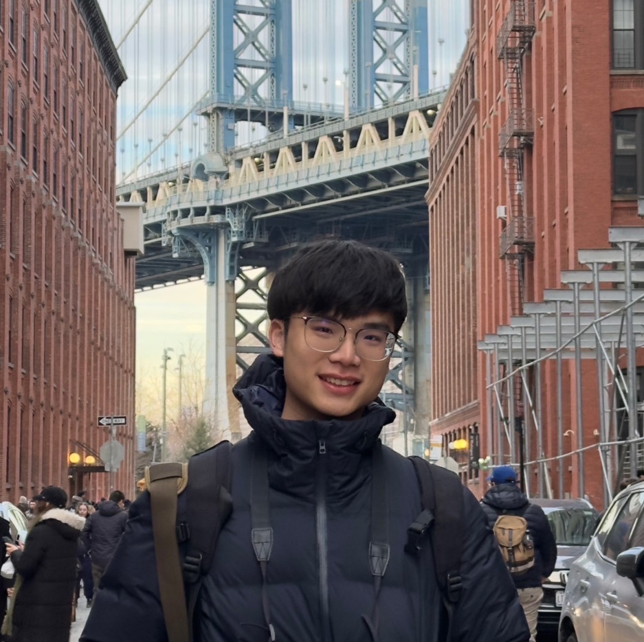

<figure style="display:inline-block;           /* 讓整塊只佔圖片寬度 */
             width:270px;                       /* 決定圖片＋caption 的寬度 */
             margin:0 auto 18px;               /* 置中 + 與下一段落留空 */
             text-align:center;">
               <!-- 1:1 裁切但不變形 -->

  <figcaption style="margin-top:6px;
                     font:500 13px/1 'Consolas','Courier New','Noto Sans Mono CJK TC',monospace;
                     letter-spacing:.2px;
                     color:#444;
                     white-space:nowrap;">    <!-- 不自動換行；可移除 -->
    Dumbo,&nbsp;USA&nbsp;(Feb.&nbsp;2025)
  </figcaption>
</figure>


[CV](http://DanielLin94144.github.io/files/Guan_Ting_Lin_CV.pdf) | [Google Scholar](https://scholar.google.com/citations?user=gojQWGIAAAAJ) | [LinkedIn](https://www.linkedin.com/in/guan-ting-lin/) | [Github](https://github.com/DanielLin94144)

Guan-Ting is currently a **final-year** Ph.D. student (**expected to graduate in _December 2025_, looking for full-time research scientist/engineer roles starting from 2026**) at the [Speech Processing and Machine Learning Lab](https://twitter.com/ntu_spml), [National Taiwan University (NTU)](https://www.ntu.edu.tw/), under the guidance of Prof. [Hung-yi Lee](https://speech.ee.ntu.edu.tw/~hylee/index.html). His research interests include **Speech LLMs, Full-Duplex Interaction, Spoken Language Understanding / Generation, and Test-Time Adaptation for Automatic Speech Recognition**.

Guan-Ting has published more than 10 **first/co-first author** top-tier Speech & NLP conferences papers (ACL, EMNLP, ICASSP, INTERSPEECH, ASRU, SLT). Notably, he received the **Best Paper Award** at IEEE SLT 2022 in Doha, Qatar. He also regularly serves as an official reviewer for prestigious conferences, including ICLR, NeurIPS, ACL, EMNLP, NAACL, and ICASSP. He is recognized as [ICLR 2025 Notable Reviewer](https://iclr.cc/Conferences/2025/Reviewers).

He has been fortunate to gain extensive **research experience** through valuable opportunities:

- **[Google DeepMind](https://deepmind.google/) (2025 Spring):** Student Researcher at Gemini Speech team (New York City), collaborating with [Kartik Audhkhasi](https://research.google/people/kartikaudhkhasi/), [Soheil Khorram](https://scholar.google.com/citations?user=gdKu-GIAAAAJ&hl=en), and [Bhuvana Ramabhadran](https://sites.google.com/view/bhuvana-ramabhadran/home) to develop methods enhancing Gemini speech capabilities in low-resource languages.

- **[Amazon AGI](https://www.amazon.science/) (2024 Summer):** Applied Scientist Intern at Speech team in Seattle, USA (under [Ivan Bulyko](https://www.linkedin.com/in/ivan-bulyko-4641392/)'s team), working with [Prashanth Gurunath Shivakumar](https://www.amazon.science/author/prashanth-gurunath-shivakumar), [Yile Gu](https://www.linkedin.com/in/yilegu), and [Ankur Gandhe](https://www.linkedin.com/in/ankur-gandhe-15277a1a/) on *Align-SLM*, the first end-to-end spoken language model with reinforcement learning.

- **[Amazon Alexa AI](https://developer.amazon.com/en-US/alexa) (2023 Summer):** Applied Scientist Intern at Speech Recognition and LM team in Seattle, USA (under [Ivan Bulyko](https://www.linkedin.com/in/ivan-bulyko-4641392/)'s team), working with [Prashanth Gurunath Shivakumar](https://www.amazon.science/author/prashanth-gurunath-shivakumar) and [Andreas Stolcke](https://scholar.google.com/citations?user=NK36Tw0AAAAJ&hl=en) on a *paralinguistics-enhanced LLM*.

- **[Amazon Alexa AI](https://developer.amazon.com/en-US/alexa) (2022 Summer):** Applied Scientist Intern at in Cambridge, USA (under [Chao Wang](https://www.linkedin.com/in/chao-wang-0414968/)'s team), working with [Chieh-Chi Kao](https://www.linkedin.com/in/chieh-chi-kao/) and [Qingming Tang](https://home.ttic.edu/~qmtang/) on acoustic event classification using neural architecture search.


Open to discussing or collaborating on speech research—feel free to reach out at ```daniel094144[at]gmail[dot]com```.

Beyond academia, he enjoys singing 🎤, photography 📷, and watching MLB games ⚾️.


<div style="display: flex; justify-content: center; flex-wrap: wrap; gap: 30px; max-width: 100%; padding: 10px;">
  <figure style="text-align: center; margin: 0; display: flex; flex-direction: column; align-items: center; width: 120px;">
    <div style="width: 100px; height: 100px; overflow: hidden;">
      
    </div>
    <figcaption style="margin-top: 8px; font-size: 14px;">NTU<br>(2021-Present)</figcaption>
  </figure>
  
  <figure style="text-align: center; margin: 0; display: flex; flex-direction: column; align-items: center; width: 120px;">
    <div style="width: 100px; height: 100px; overflow: hidden;">
      
    </div>
    <figcaption style="margin-top: 8px; font-size: 14px;">Alexa AI<br>(2022/2023 Summer)</figcaption>
  </figure>
  
  <figure style="text-align: center; margin: 0; display: flex; flex-direction: column; align-items: center; width: 120px;">
    <div style="width: 100px; height: 100px; overflow: hidden;">
      
    </div>
    <figcaption style="margin-top: 8px; font-size: 14px;">Amazon AGI<br>(2024 Summer)</figcaption>
  </figure>
  
  <figure style="text-align: center; margin: 0; display: flex; flex-direction: column; align-items: center; width: 120px;">
    <div style="width: 100px; height: 100px; overflow: hidden;">
      
    </div>
    <figcaption style="margin-top: 8px; font-size: 14px;">Google DeepMind<br>(2025 Spring)</figcaption>
  </figure>
  
  <figure style="text-align: center; margin: 0; display: flex; flex-direction: column; align-items: center; width: 120px;">
    <div style="width: 100px; height: 100px; overflow: hidden;">
      
    </div>
    <figcaption style="margin-top: 8px; font-size: 14px;">Meta Superintelligence Lab<br>(2025 Fall)</figcaption>
  </figure>
</div>


## Update 🚨
> **2025/08** Three papers accepted by _ASRU 2025_ — see you in Hawaii 🏝   
> **2025/05** [Align-SLM](https://arxiv.org/abs/2411.01834) accepted by _ACL 2025_ — see you in Vienna!  
> **2025/03** Released _Full-Duplex-Bench_ — the first benchmark for full-duplex spoken dialogue models.  
> **2024/11** Preprint of _Align-SLM_ released — first RLAIF framework for end-to-end textless SLMs.  
> **2024/09** _Continual TTA_ & _Emphasized-Talk_ accepted by EMNLP 2024 (main & findings).  
> **2024/05** _Advancing LLMs to Capture Speaking Styles_ accepted by _ACL 2024_.  
> **2024/01** Received IEEE SPS Travel Grant for ICASSP 2024!  
> **2023/12** Three papers accepted by _ICASSP 2024_ — see you in Seoul!  
> **2023/02** Internship work with Amazon Alexa accepted by _ICASSP 2023_.  
> **2023/01** Paper with Prof. Nigel Ward won **Best Paper Award** at IEEE SLT 2022!  
> **2022/07** Received ISCA Travel Grant for Interspeech 2022.  
> **2022/06** Two first-author papers accepted at _Interspeech 2022_.  


## Education
* **Ph.D.** in Communication Engineering, EECS, National Taiwan University
*[2021/9 - 2025/12]*
  * Advisor: Prof. [Hung-yi Lee](https://speech.ee.ntu.edu.tw/~hylee/index.html)
  * Transferred from M.S. program in Feb. 2023. 

## Selected Publications & Preprints
(For full publication list, please see the [Google Scholar](https://scholar.google.com.tw/citations?user=gojQWGIAAAAJ&hl=en)).

**[Speech/Text Large Language Models]**\\
_Speech understanding and generation toward human-like spoken dialogue_
* **Full-Duplex-Bench v1.5: Evaluating Overlap Handling for Full-Duplex Speech Models**\\
  <u>Guan-Ting Lin</u>, Shih-Yun Shan Kuan, Qirui Wang, Jiachen Lian, Tingle Li, Hung-yi Lee\\
  *Arxiv 2025*\\
  [paper](https://arxiv.org/abs/2507.23159) / [code](https://github.com/DanielLin94144/Full-Duplex-Bench)
* **Full-Duplex-Bench: A Benchmark to Evaluate Full-duplex Spoken Dialogue Models on Turn-taking Capabilities**\\
  <u>Guan-Ting Lin</u>, Jiachen Lian<sub>(co-second)</sub>, Tingle Li<sub>(co-second)</sub>, Qirui Wang<sub>(co-second)</sub>, Gopala Anumanchipalli, Alexander H. Liu, Hung-yi Lee\\
  *ASRU 2025*\\
  [paper](http://arxiv.org/abs/2503.04721) / [code](https://github.com/DanielLin94144/Full-Duplex-Bench)
* **Align-SLM: Textless Spoken Language Models with Reinforcement Learning from AI Feedback**\\
  <u>Guan-Ting Lin</u>, Prashanth Gurunath Shivakumar, Aditya Gourav, Yile Gu, Ankur Gandhe, Hung-yi Lee, Ivan Bulyko\\
  *ACL 2025*\\
  [paper](https://arxiv.org/abs/2411.01834)
* **Advancing Large Language Models to Capture Varied Speaking Styles and Respond Properly in Spoken Conversations**\\
  <u>Guan-Ting Lin</u>, Cheng-Han Chiang, Hung-yi Lee\\
  *ACL 2024*\\
  [paper](https://arxiv.org/abs/2402.12786) / [data](https://github.com/DanielLin94144/StyleTalk)
* **Paralinguistics-Enhanced Large Language Modeling of Spoken Dialogue**\\
  <u>Guan-Ting Lin</u>, Prashanth Gurunath Shivakumar, Ankur Gandhe, Chao-Han Huck Yang, Yile Gu, Shalini Ghosh, Andreas Stolcke, Hung-yi Lee, Ivan Bulyko\\
  *ICASSP 2024*\\
  [paper](https://arxiv.org/abs/2312.15316)
* **Can LLMs Understand the Implication of Emphasized Sentences in Dialogue?**\\
  <u>Guan-Ting Lin</u>, Hung-yi Lee\\
  *EMNLP 2024 Findings*\\
  [paper](https://arxiv.org/abs/2406.11065) / [data](https://github.com/DanielLin94144/Emphasized-Talk)

**[Self-supervised Speech Models]**\\
_Explore the utilities of self-supervised speech representations models_
* **On the Utility of Self-supervised Models for Prosody-related Task**\\
  <u>Guan-Ting Lin</u><sub>(co-first)</sub>,  Chi-Luen Feng<sub>(co-first)</sub>, Wei-Ping Huang, Yuan Tseng, Tzu-Han Lin, Chen-An Li, Hung-yi Lee, Nigel G. Ward\\
  *SLT 2022 (**Best Paper Award**)*\\
  [paper](https://arxiv.org/abs/2210.07185) / [code](https://github.com/JSALT-2022-SSL/superb-prosody)
* **Analyzing the Robustness of Unsupervised Speech Recognition**\\
  <u>Guan-Ting Lin</u><sub>(co-first)</sub>, Chan-Jan Hsu<sub>(co-first)</sub>, Da-Rong Liu, Hung-Yi Lee, Yu Tsao\\
  *ICASSP 2022*\\
  [paper](https://arxiv.org/pdf/2110.031009.pdf) / [code](https://github.com/Splend1d/wav2vec-u-patch)

**[Spoken Language Understanding and Spoken Question Answering]**\\
_End-to-end approaches to understand high-level semantic information in speech signals_
* **DUAL: Discrete Spoken Unit Adaptive Learning for Textless Spoken Question Answering**\\
  <u>Guan-Ting Lin</u>, Yung-Sung Chuang, Ho-Lam Chung, Shu-wen Yang, Hsuan-Jui Chen, Shuyan Dong, Shang-Wen Li, Abdelrahman Mohamed, Hung-yi Lee, Lin-shan Lee\\
  *Interspeech 2022*\\
  [paper](https://arxiv.org/abs/2203.04911) / [code](https://github.com/DanielLin94144/DUAL-textless-SQA) 
* **Improving Textless Spoken Language Understanding with Discrete Units as Intermediate Target**\\
  Guan-Wei Wu<sub>(co-first)</sub>, <u>Guan-Ting Lin</u><sub>(co-first)</sub>, Shang-Wen Li, Hung-yi Lee\\
  *Interspeech 2023*\\
  [paper](https://arxiv.org/abs/2305.18096)
* **SpeechDPR: End-to-End Spoken Passage Retrieval for Open-Domain Spoken Question Answering**\\
  Chyi-Jiunn Lin, <u>Guan-Ting Lin</u>, Yung-Sung Chuang, Wei-Lun Wu, Shang-Wen Li, Abdelrahman Mohamed, Hung-yi Lee, Lin-shan Lee\\
  *ICASSP 2024*\\
  [paper](https://arxiv.org/abs/2401.13463)

**[End-to-end ASR Test-time Adaptation]**\\
_Sample-dependent test-time adaptation to improve ASR on out-of-domain speech_

* **SUTA-LM: Bridging Test-Time Adaptation and Language Model Rescoring for Robust ASR**\\
  Wei-Ping Huang<sub>(co-first)</sub>, <u>Guan-Ting Lin<sub>(co-first)</sub></u>, Hung-yi Lee\\
  *ASRU 2025*\\
  [paper](https://arxiv.org/abs/2506.11121) / [code](https://github.com/hhhaaahhhaa/ASR-TTA)
* **Continual Test-time Adaptation for End-to-end Speech Recognition on Noisy Speech**\\
  <u>Guan-Ting Lin<sub>(co-first)</sub></u>, Wei-Ping Huang<sub>(co-first)</sub>, Hung-yi Lee\\
  *EMNLP 2024*\\
  [paper](https://arxiv.org/abs/2406.11064) / [code](https://github.com/hhhaaahhhaa/Dynamic-SUTA)
* **Listen, Adapt, Better WER: Source-free Single-utterance Test-time Adaptation for Automatic Speech Recognition**\\
  <u>Guan-Ting Lin</u>, Shang-Wen Li, Hung-Yi Lee\\
  *Interspeech 2022 (Oral)*\\
  [paper](https://arxiv.org/abs/2203.14222) / [code](https://github.com/DanielLin94144/Test-time-adaptation-ASR-SUTA)

## Patents
* Inventor on a pending U.S. patent application in speech and language processing, filed by Google DeepMind (details confidential until publication)


## Award
* IEEE Signal Processing Society Travel Grant @ ICASSP 2024
* Best paper award @ IEEE SLT 2022
* NTU Elite Doctoral Scholarship
* GICE Elite Doctoral Scholarship with NVIDIA
* ISCA travel grant @ Interspeech 2022
* Appier top-tier conference scholarship
* Dean's list * 3 @ NTHU
* Phi Tau Phi Award @ NTHU
* The Zhu Shun Yi He Qin Scholarship @ NTHU

## Academic Services
* **Official Reviewer**: ICLR'24'25, NeurIPS'24'25, ACL'24'25, EMNLP'24, NAACL'23'24, ICASSP'23'24, ISCSLP'22'23'24, COLING'25

<script type="text/javascript" id="clustrmaps" src="//clustrmaps.com/map_v2.js?d=7Qw12O7m4eZyJ9EztFY7V_gZbGDuLrM-MTmcSbviX2w&cl=ffffff&w=a"></script>

